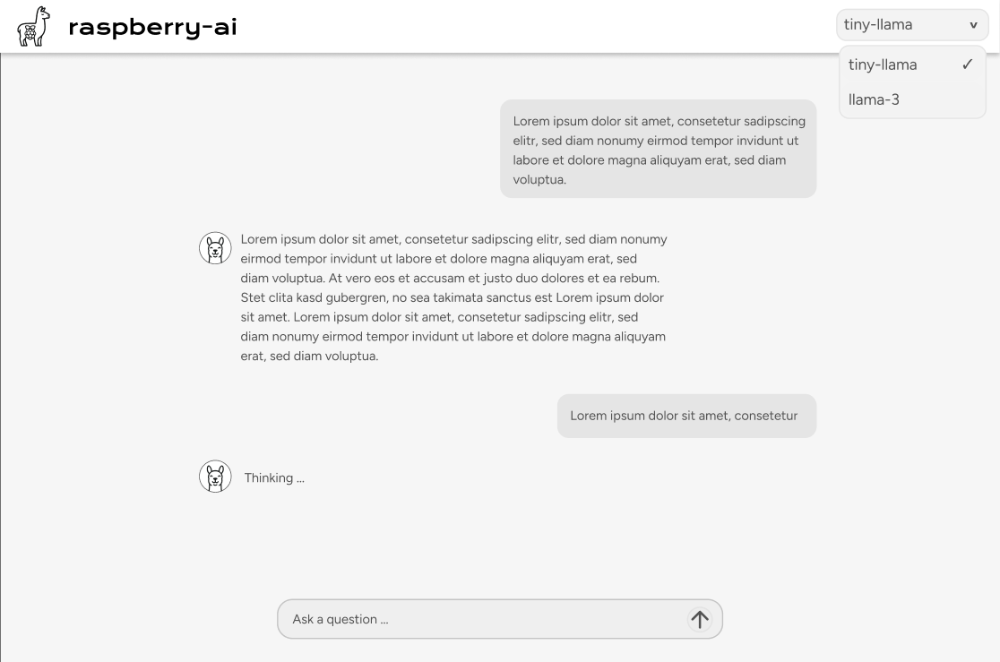

# raspberry-ai

A project that runs tiny-llama on a Raspberry Pi 5 with a web interface to interact with the AI.

## Project Structure

```text
raspberry-ai/
├── app.py              # FastAPI backend server
├── requirements.txt    # Python dependencies
├── frontend/           # Next.js frontend application
├── docs/              # Documentation and assets
└── README.md          # This file
```

## Website Mockup



## How to setup ollama on your pi

Ensure your Raspberry Pi is running a 64-bit operating system. Ollama won't work on 32-bit systems.

### Installing ollama

```sh
sudo apt install curl
```

```sh
curl -fsSL https://ollama.com/install.sh | sh
```

Confirm installation with:

```sh
ollama --version
```

### Installing tinyllama and llama-3

```sh
ollama run tinyllama
ollama run llama3
```

Now you can ask the model questions and have conversations using the terminal.

## Running the Frontend

```sh
npm install
```

```sh
cd frontend
npm run build
npm start
```

You can now view the website on [http://localhost:3000](http://localhost:3000)

## Running the Python API

### Prerequisites

Make sure you have Python 3.8+ installed on your system.

### Installing Python Dependencies

First, create a virtual environment (recommended):

```sh
python -m venv .venv
```

Activate the virtual environment:

**On Windows:**

```sh
.venv\Scripts\activate
```

**On Linux/macOS:**

```sh
source .venv/bin/activate
```

Install the required packages:

```sh
pip install -r requirements.txt
```

Or install them individually:

```sh
pip install fastapi uvicorn[standard] requests pydantic
```

### Running the API Server

Start the FastAPI server with uvicorn:

```sh
uvicorn app:app --reload --host 0.0.0.0 --port 8000
```

The API will be available at:

- Main API: [http://localhost:8000](http://localhost:8000)
- API Documentation: [http://localhost:8000/docs](http://localhost:8000/docs)
- Alternative docs: [http://localhost:8000/redoc](http://localhost:8000/redoc)

### API Endpoints

- **POST /chat**: Send a message to the AI
  - Request body: `{"prompt": "Your message here"}`
  - Response: `{"reply": "AI response"}`

### Note

Make sure Ollama is running on your system before starting the API server, as the backend communicates with Ollama on `http://127.0.0.1:11434`.
